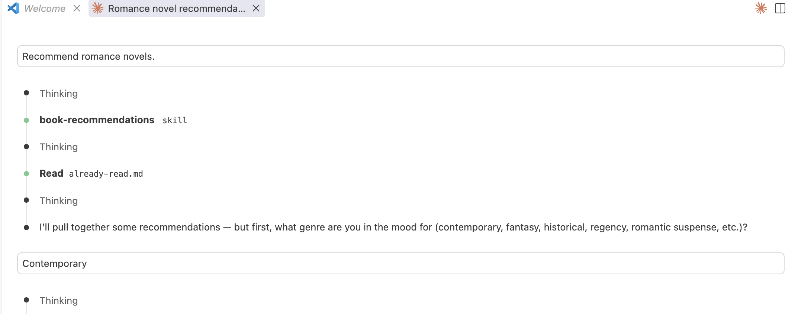
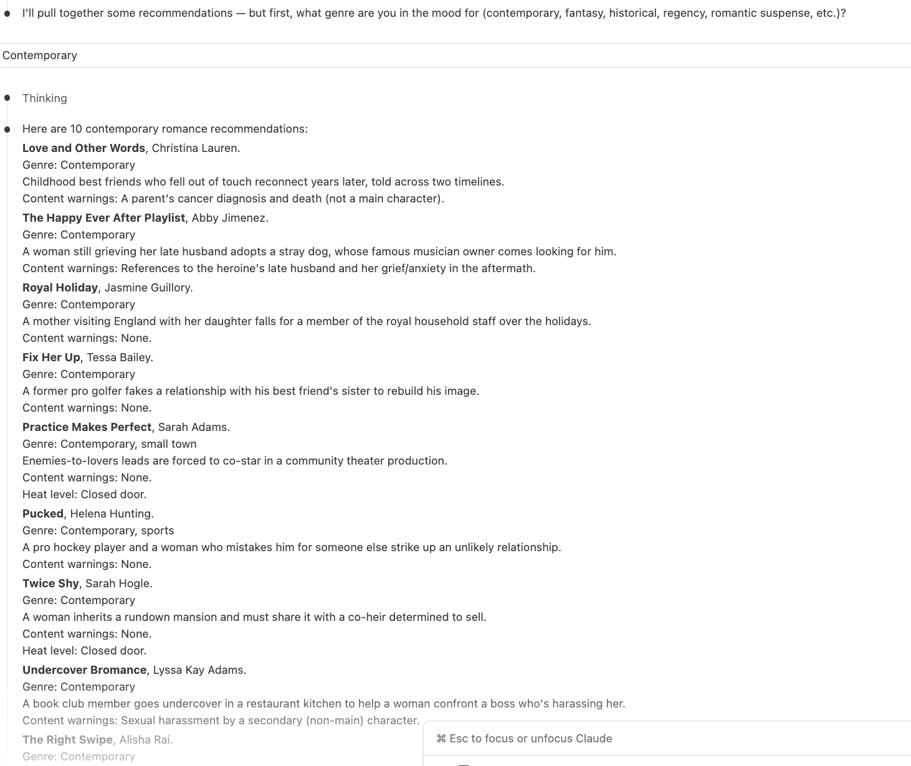
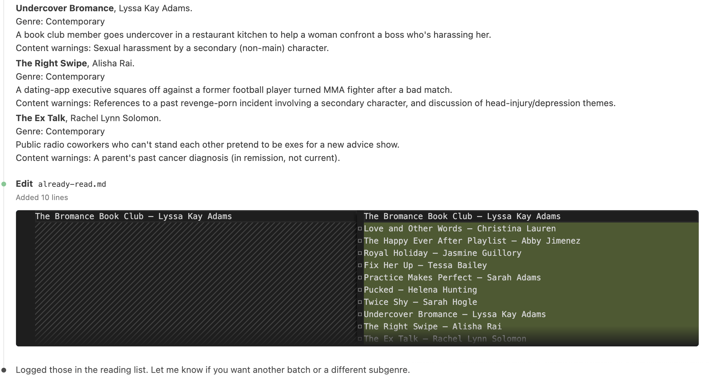

# Book Recommendations Skill

[The skill](https://github.com/nellcgram/nellcgram.github.io/blob/main/.claude/skills/book-recommendations/SKILL.md)

[The rubric](https://github.com/nellcgram/nellcgram.github.io/blob/main/.claude/skills/book-recommendations/rubric.md)

This skill recommends romance novels. It filters out particular categories (novellas, mafia/vampire/demon/alien characters, anyone under 18, YA, small-town settings), excludes a list of specific authors I dislike, enforces a strict output format with content warnings, and does not announce what it filtered out.

## The Problem

Before I built the skill, Claude was giving me recommendations of authors I disliked, repeating authors in the list, and including books I had read already. Often there were not enough recommendations so I had to keep editing my prompt to Claude.

## What I Built
It only gives me recommendations I have not read, in my preferred format, in groups of 10 at a time.

Screenshots

Here is what that looks like:

## How I Built It
I created the written skill in VS Code and tested it with Claude Code.

## Challenges

In the first round of testing, I had a missing closing "---" that would have broken the file. I also had a sentence that contradicted itself (it said no children but also allowed for children in the epilogue).

In the second round, I realized the list of books I did not want recommended was huge and would make the skill too long to read easily, so I created the already-read.md file so I had a separate place to store past titles.

In the third round, results still included books I had read that I had not added to already-read.md initially. I edited the skill to add all recommendations to the "do not recommend" list after recommending them.

## Future Improvements

I am still considering whether the summary is necessary, and if it should be shortened.