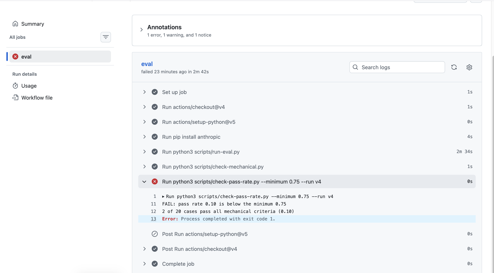
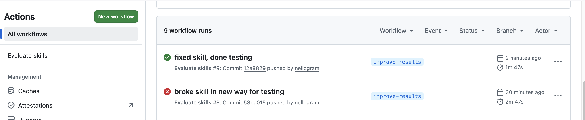

# Docs Assistant: Two Claude Code Skills and How I Tested Them

Source and full write-up: [github.com/nellcgram/docs-assistant](https://github.com/nellcgram/docs-assistant)

## What I built

Two Claude Code skills for documentation work:

- **release-notes** turns git commit messages into user-facing release notes.
- **doc-review** reviews a document against a checklist.

I built a full evaluation around `release-notes`: 20 real commits, a hand-written answer key, a graded rubric, scripted runs, and a GitHub Action that fails a push when quality drops. `doc-review` was checked by eye.

## Results

| What I measured | Result |
|---|---|
| First version of the skill | 0 of 20 |
| After fixing the spec | 19 of 20 |
| First scripted run (one API call per commit) | 15 of 20 |
| Cases that pass in all 5 repeats | 9 of 20 |
| Whether the right skill fires | 18 of 20, before and after rewording |
| CI check on a deliberately broken skill | failed at 0.10, passed at 0.85 once fixed |

All scores come from the same 20 commits I tuned the skill against, graded by me alone. They show how the skill behaved on those cases, not that it works on commits it has never seen.

## What I learned

1. **My first 0 of 20 was my own documents disagreeing.** The rubric required past tense and no internal file names, and the skill never said either. Most of the climb to 19 of 20 was making the spec and the rubric agree, not the model improving.
2. **A passing test gate can be nearly blind.** I broke the skill five ways on purpose. Four of the breaks still passed, because the shared files repeat the key rules and the model followed those. Duplicated instructions make a prompt robust and its tests insensitive.
3. **How I called the skill changed the score more than most rule edits.** The same skill scored 20 of 20 with all commits in one request and 4 of 20 with one call per commit.
4. **The skill is right more often than it is consistent.** Across 5 repeats, only 9 of 20 cases passed every time, and my own run summaries turned out wrong until I graded one row per case.

## The CI test

The failing run's log shows the gate doing its job: every earlier step succeeded, then the pass-rate check reported a rate of 0.10, below the 0.75 minimum.

After I reverted my deliberate break, the next run passed.

I have since retired the workflow because it made API calls on every push. The screenshots are the record, and the workflow file is in the repository history.

## Known limits

The automated check catches large regressions but not subtle ones. The skill descriptions miss vague or out-of-scope prompts, and repeat consistency is unresolved. The [case study](https://github.com/nellcgram/docs-assistant/blob/main/case-study.md) in the repository covers each one, and every number links to the file behind it.
